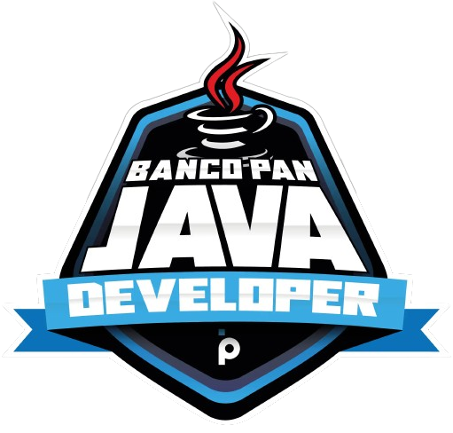

## Banco Pan Java Developer

🖖🏻Olá mundo Este é um repositório reservado para exercícios, testes, e aprendizados do bootcamp da DIO, 
**BANCO PAN JAVA DEVELOPER**, os conteúdos aqui apresentados em sua maioria são materiais introdutórios 
e para fins didáticos, por isso alguns arquivos e pastas podem não seguir algumas normas ou convenções da linguagem Java! 

 ## ☕Requisitos deste BootCamp

✅ Java JDK 11

✅ IDE de desenvolvimento foi realizado integralmente com o Intellij. 

## 🗂️ Ementa

🤓 [**O primeiro Programa em Java**:](https://github.com/dvctrl/banco-pan-java-developer/tree/master/1.primeiro-programa-java/primeiro-programa-intellij) Tema introdutório para conhecer o Intellij, e as suas ferramentas;   

🌱 [**Conhecendo a Sintax Java**:](https://github.com/dvctrl/banco-pan-java-developer/tree/master/2.sintaxeJava/sintax-java/src/edu/david) Aqui temos a introdução às principais mecânicas do Java, sendo elas: Arrays e Loops, Escopos de Método e Classe, Controle de Fluxo a Anatomia das Classes, dentre outros; 

🔗 [**Estrutura de dados**:](https://github.com/dvctrl/banco-pan-java-developer/tree/master/3.Estrutura-de-dados-java) Campo reservado para estudos sobre: Listas Encadeadas, Filas, Pilhas,  Arvore Binárias, dentre outros. 

⚙️ [**Métodos**:](https://github.com/dvctrl/banco-pan-java-developer/tree/master/4.Metodos-Java) Introdução a sintax e funcionamento dos métodos, bem como suas aplicações, parâmetros, sobrecargas e retornos.  

 ## 🗃️ Certificados

* **Módulos**

  * ### ☕Conhecendo a Linguagem de programação Java

    * ☑️[Aprendendo a Sintaxe Java;](https://hermes.digitalinnovation.one/certificates/cover/EA06C52B.jpg)
    * ☑️ [Lógica Condicional e Controle de Fluxos em Java;](https://hermes.digitalinnovation.one/certificates/cover/D9BA9675.jpg)
    * ☑️ [Estruturas de Repetição e Arrays em Java](https://hermes.digitalinnovation.one/certificates/cover/C1093925.jpg);
    * ☑️ [Estrutura de Dados em Java](https://hermes.digitalinnovation.one/certificates/cover/1A83EB68.jpg); 
    * ☑️ [Entendendo métodos em java](https://hermes.digitalinnovation.one/certificates/cover/533A1C0E.jpg);
